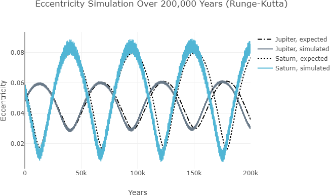

# Bulirsch-Stoer-Instability

Bulirsch-Stoer instability in ORSA visualised with Java Plotly.

---

<figure style="width:522px;">
  
  <figcaption>Figure 1. Eccentricity variation for Jupiter (low amplitude) and Saturn (high amplitude) over 200,000 years, from Runge-Kutta integration. Analytical approximations are overlaid as dotted lines. The results of Runge-Kutta integration in legacy ORSA correspond to the analytical approximations, albeit with a growing divergence over time. Adapted from Stenborg (2024), below.</figcaption>
</figure>
 
 

<figure style="width:522px;">
  
  <figcaption>Figure 2. Eccentricity variation for Jupiter (low amplitude) and Saturn (high amplitude) over 200,000 years, from Bulirsch-Stoer integration. Analytical approximations are overlaid as dotted lines. The results of Bulirsch-Stoer integration in legacy ORSA diverge significantly from the analytical approximations (e.g., amplitude, period, vertical shift). Adapted from Stenborg (2024), below.</figcaption>
</figure>

---

### Key Files

- EccentricitySimulation.java &nbsp;&nbsp; A Java program for visualising orbital element variation with the Tablesaw wrapper for Plotly. 
- ORSA_Output.csv &nbsp;&nbsp; Jovian and Saturnian eccentricity and inclination evolution data, as calculated via analytical means, and as simulated using Runge-Kutta and Bulirsch-Stoer integration in ORSA. 
- pom.xml &nbsp;&nbsp;&nbsp; Maven dependencies to make Tablesaw available, specified as a Project Object Model.

### Software Requirements

- Java. 
- Java IDE, e.g., Eclipse (optional). 

### Reference

Stenborg, TN 2024, "[Bulirsch-Stoer Instability in ORSA with Java Plotly Visualisation](https://aspbooks.org/custom/publications/paper/535-0459.html)", in BV Hugo, R Van Rooyen and OM Smirnov (eds), ADASS XXXI, ASP, Orem, UT, pp. 461&ndash;464.
